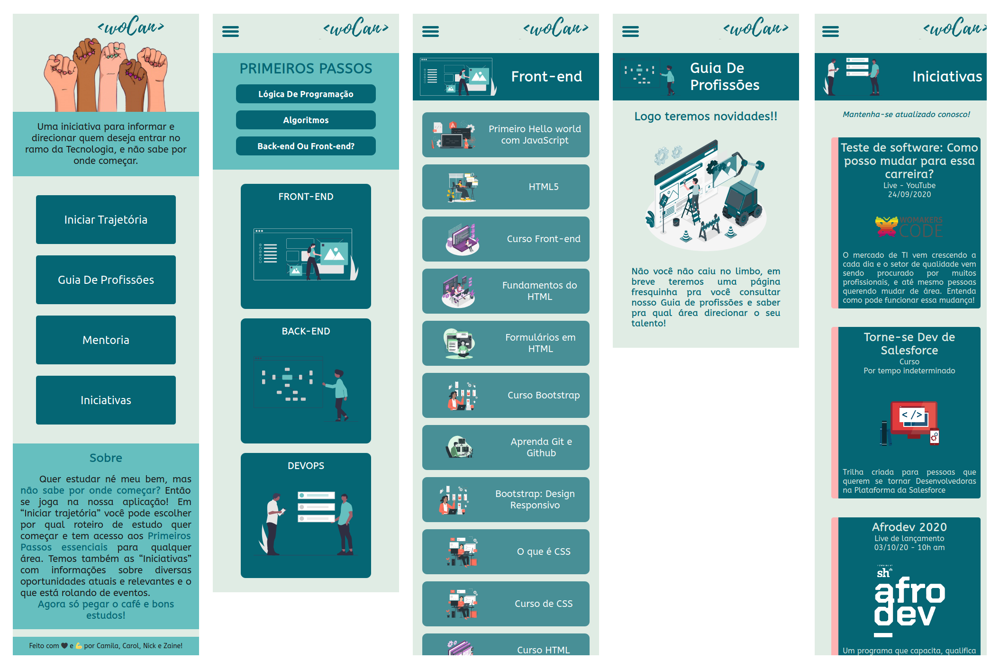
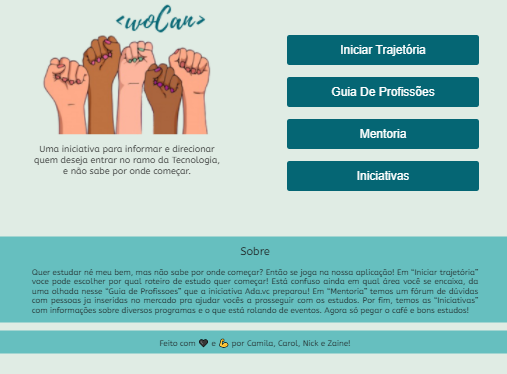
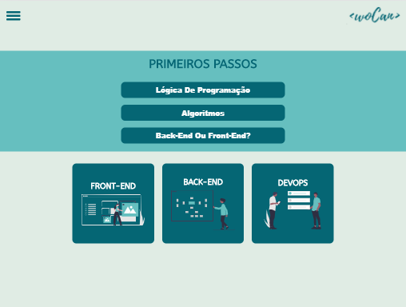
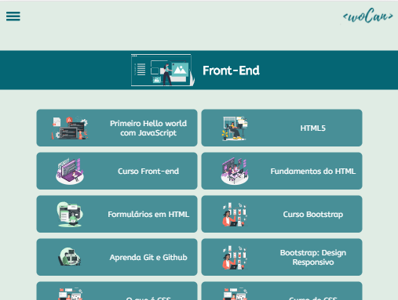
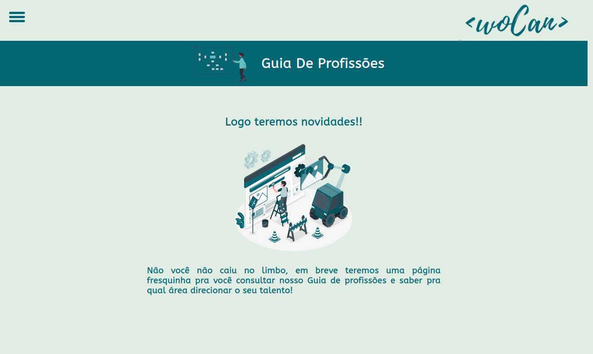
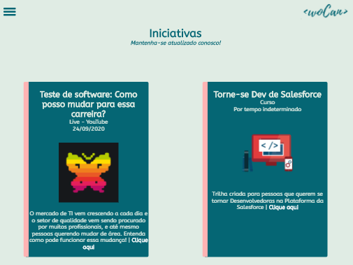

# Talent Fest 2020 - CI&T


## Índice

[Introdução](#introdução) | [Desafio CI&T](#Desafio-CI&T) | [Solução](#Solução) | [Estrutura e funcionalidades](#estrutura-e-funcionalidades) | [Instalação e execução](#instalação-e-execução-octocat) | [Tecnologias e bibliotecas utilizadas](#tecnologias-e-bibliotecas-utilizadas-star) | [Implementações futuras](#implementações-futuras)

---

## Introdução

### WoCan, Mudando a sua vida e o mundo.

Para Mulheres jovens e adultas que desejam ingressar no ramo de tecnologia.  
WoCan é uma web aplicação que oferece suporte, informação e direcionamento para essas mulheres.  
Diferentemente das iniciativas atuais o nosso produto é simples e direto, diminuindo as barreiras entre as mulheres e o conhecimento.

## Desafio CI&T

Este projeto foi realizado durante o _Talent Fest_, _hackathon_ realizado pela Laboratória para conectar as alunas com empresas parceiras, o nosso desafio foi proposto pela CI&T e consistia em fazer o MVP de um produto digital que engajasse mulheres na tecnologia.

## Solução

Nós desenvolvemos uma página para ser utilizada tanto por mulheres iniciantes na programação, quanto para mulheres que desejam se atualizar sobre eventos e cursos, desenvolvemos com o conceito de _mobile first_, responsivo, acessível e com linguagem inclusiva.

## Estrutura e funcionalidades

Destinamos aos iniciantes a página **Iniciar Trajetória**, onde a usuária tem acesso aos **Primeiros Passos** e pode acessar alguns conteúdos básicos para iniciantes na programação, como lógica de programação, algoritmos e as diferenças entre back-end e front-end.  
Também é possível acessar conteúdos voltados para as áreas de **Front-end**, **Back-end** e **DevOps**, nas suas páginas específicas.  
As páginas **Guia de Profissões** e **Mentoria** em construção no momento, vão fornecer um guia com as principais profissões em tecnologia e um espaço para que mulheres que já atuam na área possa mentorar as que estão iniciando.  
Na página de **Iniciativas** a usuária se mantêm atualizada sobre cursos, eventos, lives, e relacionados.








## 7. Instalação e execução :octocat:

- Clone o projeto na sua máquina executando o seguinte comando no seu terminal:

```sh
$ git clone <link-do-repositório>
```

- Instale as dependências do projeto com o comando:

```sh
$ npm install
```

- Rode o projeto na sua máquina com:

```sh
$ npm start
```

- E visualize o projeto no seu navegador com o link:

```sh
http://localhost:3000
```

## Tecnologias e bibliotecas utilizadas :star:

- [React](https://reactjs.org/)
- [React Hooks](https://pt-br.reactjs.org/docs/hooks-intro.html)
- [React Router](https://reactrouter.com/web/guides/quick-start)
- [Babel](https://babeljs.io/)
- [Webpack](https://webpack.js.org/)
- [Sass](https://sass-lang.com/)
- [Firebase](https://firebase.google.com/)
- [Eslint](https://www.npmjs.com/package/eslint-plugin-react)

## Implementações futuras

- Guia de profissões - página com um guia das principais profissões em tecnologia.
- Mentoria - espaço de interação com mulheres que já atuam no mercado e estão dispostas a ajudar outras mulheres.

**Projeto realizado por [Amanda Zaine](https://github.com/AmandaZaine), [Camila Cunha](https://github.com/camilagerarde), [Carol Moscheta](https://github.com/lz-tangerine) e [Nicole França](https://github.com/nicolefranca) para o hackathon realizado pela [Laboratória](https://github.com/Laboratoria).**

[](https://forthebadge.com)
